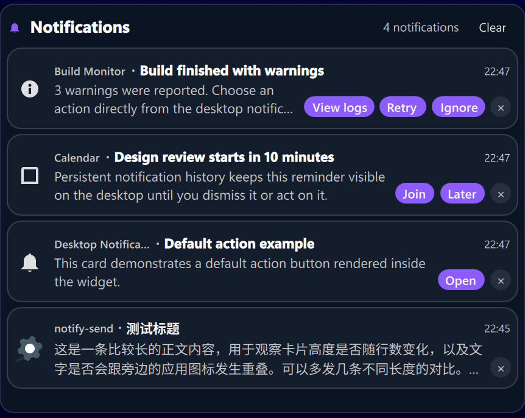
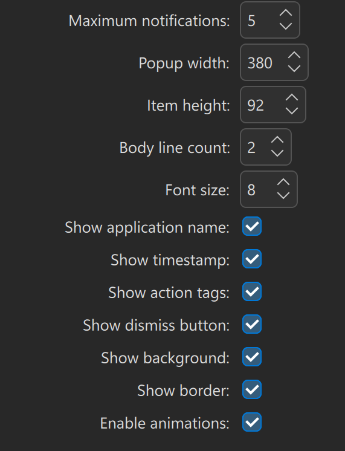

# Desktop Notification

A Plasma 6 widget that keeps recent KDE notifications visible on the desktop.

Desktop Notification is designed for users who want a small, persistent notification history instead of short-lived popups. It uses KDE's notification model directly, so notification actions, default actions, dismiss behavior, timestamps, and application metadata stay connected to the system notification service.

## Screenshots

Recent notifications with action tags and dismiss buttons:



Configuration page:



## Features

- Shows recent KDE notifications as compact desktop cards.
- Uses KDE's notification model directly instead of maintaining a separate history list.
- Supports notification default actions such as Open/View.
- Supports multiple notification action buttons.
- Supports dismissing individual notifications from the KDE notification list.
- Optional dismiss button, action tags, application name, and timestamp.
- Configurable maximum visible notifications.
- Configurable item height, body line count, popup width, and unified font size scaling.
- Optional card background, border, and animations.
- Shows nothing when there are no notifications.
- Works as a desktop widget, with a compact panel representation available as well.

## Requirements

- KDE Plasma 6
- Qt 6 / Kirigami
- `org.kde.notificationmanager`

The widget metadata declares Plasma API compatibility from 6.0 to 7.99.

## Install

Clone or download this repository, then install it as a local Plasma applet:

```bash
kpackagetool6 --type Plasma/Applet --install .
```

If you already have an older local copy installed:

```bash
kpackagetool6 --type Plasma/Applet --upgrade .
```

Restart Plasma Shell if the widget list does not update immediately:

```bash
systemctl --user restart plasma-plasmashell.service
```

Then add **Desktop Notification** from Plasma's widget picker.

## Package

Create a `.plasmoid` package from the repository root:

```bash
zip -r desktopnotification-1.0.0.plasmoid metadata.json contents README.md screenshots
```

The package can be uploaded to KDE Store or installed locally:

```bash
kpackagetool6 --type Plasma/Applet --install desktopnotification-1.0.0.plasmoid
```

## Configuration

Available settings include:

- Maximum notifications
- Popup width
- Item height
- Body line count
- Font size
- Show application name
- Show timestamp
- Show action tags
- Show dismiss button
- Show background
- Show border
- Enable animations

## Notes

The widget intentionally does not display a placeholder when there are no notifications.

Notification icons prefer the icon provided by the notification itself, then fall back to the application icon, then to a generic system icon.

## License

MIT
